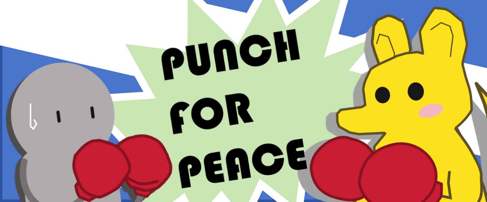

## Game: Punch for Peace 🥊



## **Story Background:**

> Kangaroo: “I can’t control myself, I just throw punches when I get excited!”
>
> Human: “But you might hurt me by accident! How are we supposed to get along?”
>
> And so, a strange duel begins…

---

## **Description:**

This is a small prototype game created for a mini GameJam project.

It’s a playful mix of **checkers**, **chess**, and **arcade-style boxing**, featuring an Australian touch — a **boxing kangaroo** 🦘.

Players move, dodge, and block in the game of jumping and walking, experience the peaceful battle in the name of "fist".

🎮 **Genre & Mode:** Action / Strategy / Single-player / PvE

🦘 **Characters:** Human & Kangaroo

🎨 **Art Style:** PPT-made visuals (simple and charming)

⚙️ **Engine:** Python + Pygame

🔥 **Core Mechanics:** 

- Win/Loss condition: Stamina bar, ~1 minutes per round
- Best of 3 round
- Whoever’s stamina reaches zero first loses
- Block: both sides lose stamina
- Each kangaroo jump consumes more stamina
- Stalemate scenario: due to movement differences, sometimes they can never reach each other → becomes a strategy point

---

## How to Run

1. Make sure Python ≥ 3.10 and install dependencies:

   ```
   pip install -r requirements.txt
   ```

2. Run the game:

   ```
   python src/main.py
   ```

